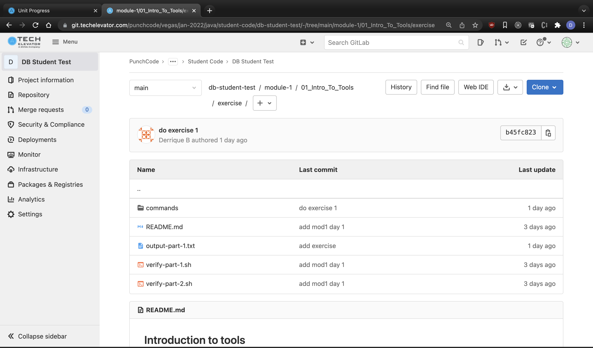
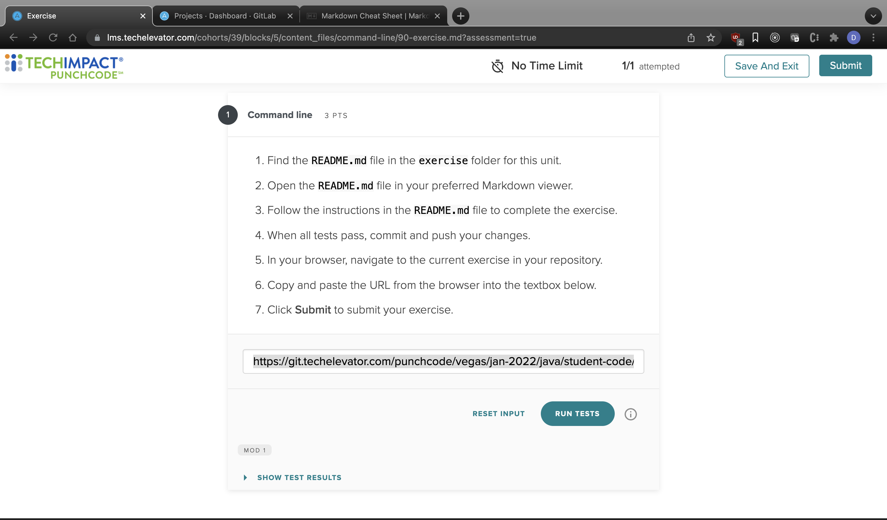

# How to merge changes from Instructor Code Repo

1. stage and commit changes in your local repo folder if there is any - meaning there is a yellow x your local repo folder

```
git add -A
git commit -m 'your message'
```

2. OPTIONAL - push your changes to your gitlab

```
git push
```

3. fetch changes from instructor-code

```
git fetch upstream
```

4. merge changes from instructor-code

```
git merge upstream/main
```

## NOTES

if your can't fetch from upstream, verify your remote by entering this in terminal

```
git remote -v
```

it should look like below

```
origin	git@git.techelevator.com:punchcode/vegas/jan-2022/java/student-code/<your repo name> (fetch)
origin	git@git.techelevator.com:punchcode/vegas/jan-2022/java/student-code/<your repo name>  (push)
upstream	git@git.techelevator.com:punchcode/vegas/jan-2022/java/instructor-code.git (fetch)
upstream	git@git.techelevator.com:punchcode/vegas/jan-2022/java/instructor-code.git (push)
```

if is does not run this code in your terminal while in your repo folder and verify

```
git remote add upstream git@git.techelevator.com:punchcode/vegas/jan-2022/java/instructor-code.git
```

to verify run

```
git remote -v
```

# How to push your code to your gitlab

```
git add -A
git commit -m 'your message'
git push
```

# How to submit hw / exercises

1. make sure to push your code to gitlab via

```
git add -A
git commit -m 'your message'
git push
```

2. go to your gitlab in your browser and navigate to your the respective exercise folder.

3. copy the text in the address bar
   

4. got to the LMS and navigate to the exercise and paste in the address that was previously copied

   

5. click on run test and verify test

6. click on submit
