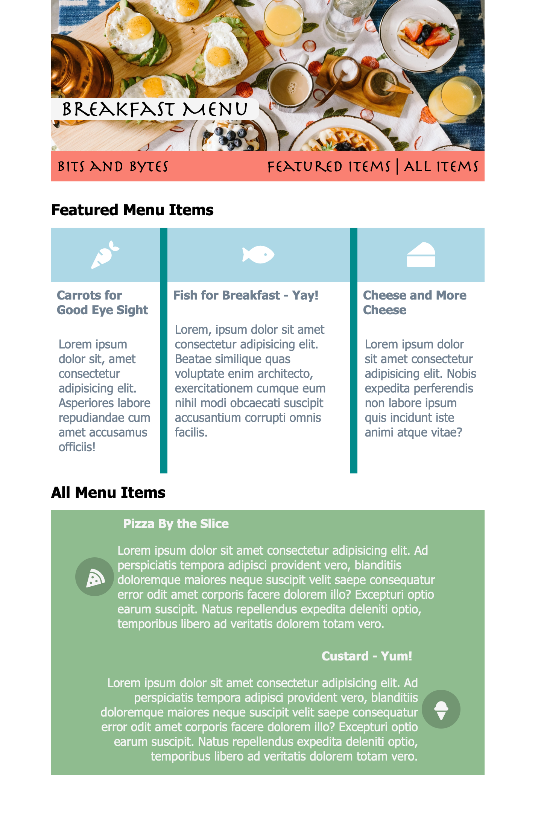

# CSS Flexbox

## Overview of session

In this lecture, you'll lay out each area of a restaurant website using CSS Flexbox. The students' starting lecture code contains the HTML markup and two stylesheets: `styles.css` for general styling and `flexbox.css` where you'll add the flexbox rules. All of the basic styling rules are provided. You'll add flexbox rules to the `flexbox.css` file to complete the design.

The lecture notes use a wireframe that resembles the image below. You're encouraged to teach from the wireframe and build the solution over time rather than displaying the final image to the students upfront.

The final product is responsive. It looks like this:

## Session objectives

- Lay out a series of elements using Flexbox
- Define a Flexbox container using a row or a column
- Apply normal flow to Flexbox items using `flex-wrap`
- Apply content alignment to flex items using `justify-content` and `align-items`
- Arrange items within a Flexbox container using `order`
- Size items within a Flexbox container using `flex-basis`, `flex-grow`, `flex-shrink`
- Understand how to add Flexbox layouts to existing Responsive CSS Grid layouts
- Understand when to use Flexbox or Grid or combine them both

> #### Note: There was a conscious decision to exclude the shorthand properties to cut down on student confusion.

## Instructor notes

- [Lecture Walkthrough](./lecture-code.md)

## Instructor references

- [A Complete Guide to Flexbox](https://css-tricks.com/snippets/css/a-guide-to-flexbox/)
- [Flexbox Playground](https://codepen.io/enxaneta/full/adLPwv/)
- [Flexbox Examples](https://flexbox.webflow.com/#examples)
