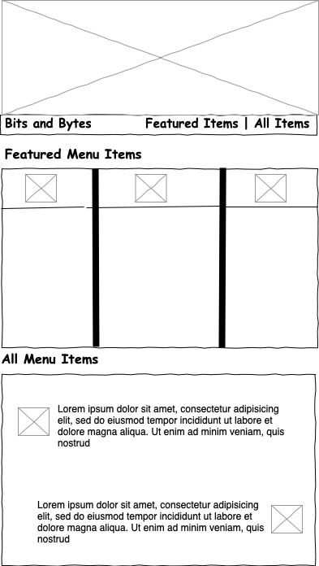
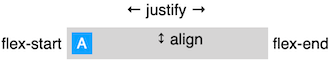

# Lecture Code Walkthrough

## Starting with a wireframe

The student book points out several criteria for choosing CSS Grid versus CSS Flexbox. The students may still have questions about when you should use one over the other, or both.

The book uses an analogy of a house blueprint versus a room of furniture to explain that an architect is concerned about how _all_ the spaces work together, while an interior designer is concerned about arranging things within _one_ of those spaces at a time. A blueprint versus furniture layout is the idea.

To reinforce this concept, show the students the wireframe below for the design. Review the wireframe image and point out the flexbox containers. Feel free to highlight or draw boxes around them. This is a good opportunity to whiteboard, too.



Consider outlining the three primary blocks: the footer for the image at the top of the page, the centered icons within the three columns, and the alternating icon and text at the bottom. Each block becomes a flexbox container used to create the alignment and spacing shown in this diagram.

You'll notice the `<body>` element is also a flexbox container. This center aligns the entire page.

The nine flexbox containers in the HTML, using CSS selectors, are:

```css
- body /* flex-direction: column (page content centering) */
- #hero footer  /* flex-direction: row (space-between) */
- #featured section /* flex-direction: row (align-stretch) */
- #featured section article div /* X3 flex-direction: row  (center/center icon) */
- #all-items section /* flex-direction: column */
- #all-items section article /* X2 flex-direction: row (alternating flex order) */
```

You'll implement these in the next section.

## Implementing with CSS

Now you need to set up Flexbox. Add CSS to the `flexbox.css` file that enables each of the flexbox containers. Point out that by setting `display` to `flex`, an HTML element becomes a _flexbox container_. Remind the students that the direct children of that element are _flexbox items_.

Next, explain that the default `flex-direction` for Flexbox is `row`, and therefore the `body` and `#all-items` sections need `flex-direction: column`.

Then, add this CSS to `flexbox.css`:

```css
body,
#hero footer,
#featured section,
#featured section article div,
#all-items section,
#all-items section article {
  display: flex;
}

body,
#all-items section {
  flex-direction: column;
}
```

## Centering content on the page

This is a good time to discuss `align-items`, `justify-content`, and how they differ. The wireframes indicate that the content must be centered horizontally and vertically. Feel free to show this image from the student book:



### Centering horizontally

First, you'll center the content horizontally. The items from the wireframes that need to be centered are the `body`, the icons inside of `featured section article div`, and the content in `#all-items section article`.

Add this CSS to `flexbox.css`:

```css
body {
  align-items: center;
}

#featured section article div {
  justify-content: center;
}

#all-items section article {
  justify-content: center;
}
```

> Note that your usage of `align-items` and `justify-content` varies because `body` has a `flex-direction` of column. In most cases throughout this example, `align-items` centers content vertically because the `flex-direction` is set to row.

### Centering vertically

After centering the content horizontally, you'll center the content inside of `#hero footer` and line up the content with the icons inside of each `#all-items section article`.

Add this CSS to `flexbox.css`:

```css
#hero footer,
#all-items section article {
  align-items: center;
}
```

There have been major visual changes. Before you move on, make sure the students understand how to use `display: flex`, `flex-direction`, `align-items`, and `justify-content`.

## Applying layout to each flexbox container

### Modify the hero footer with `justify-content`

Next, you’ll work on the Hero footer. The footer just below the image at the top of the page has all of its text run together on the left side as it exhibits “normal flow.” The links must be on the right side while the text remains on the left.

To do this, add the `justify-content` property to the `#hero footer` with the value `space-between`. This is a good opportunity to show the various spacing settings available with `justify-content`:

```css
#hero footer {
  justify-content: space-between;
}
```

### Adjust spacing with `flex-basis`

In the bottom block, you can adjust the spacing so the icon and text are distributed as the design suggests. Use this opportunity to explain that spacing elements requires one of the flexbox items to inform the flexbox container of a width. In this case, the icons have a width assigned in the `styles.css` file, but the text doesn't. The `flex-basis` property performs this function by allocating space relative to the others within the container.

Set the flex-basis on the last div of the `#all-items article` container so the spacing can be achieved. Use the pseudo-selector `:last-child`:

```css
#all-items article div:last-child {
  flex-basis: 80%;
}
```

Now, the text and icons are spaced properly. However, the bottom flexbox container doesn't match the required layout just yet.

### Arrange flexbox items

This is a good time to show the students how to re-arrange the items to match the requirement. The actual requirement is for every odd row to alternate the icon's position to the right. You can do this in one of two ways: using either the `order` property on the first div or the `flex-direction: row-reverse` property on the article:

```css
#all-items article:nth-child(even) div:first-child {
  order: 2;
}

#all-items article:nth-child(even) {
  flex-direction: row-reverse;
}
```

Now, the second row's icon is on the right.

## Add responsiveness to Flexbox

The last problem to address is the responsive nature of the layout. As you drag the window's edge to make the viewport smaller, notice the center flexbox, `#featured`, stays in a three-column layout. You need to have the layout adjust when the viewport gets below `1024px`. There are two ways to solve this problem.

The first uses the property discussed in the Student Book, `flex-wrap`, while the other uses `flex-direction`. They both create the same result. You're encouraged to teach the Student Book version.

Add a media query for a `max-width: 1024px`. There are multiple HTML elements with a class of `flex-row` within the `#featured` `<section>`. Add the `flex-wrap` property with a value of `wrap`:

```css
@media screen and (max-width: 1024px) {
  #featured section {
    flex-wrap: wrap;
  }
}
```

Students may ask you if you can make that container into a column, too. The answer is yes. Here's an alternate solution:

```css
@media screen and (max-width: 1024px) {
  #featured section {
    flex-direction: column;
  }
}
```

Now, when resizing the screen to make it smaller, the center three-column layout wraps into a column layout at 1024px.

When wrapped, the left and right borders don't look good on that center column. If you prefer to remove them, add this CSS to the media query:

```css
#featured section article:nth-child(even) {
  border: none;
}
```

Now, at screen widths below `1024px`, the left and right borders are removed from the center column.
